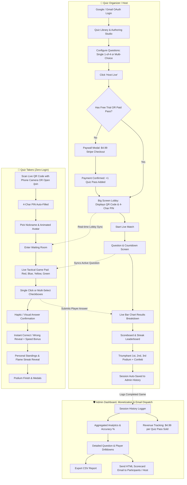
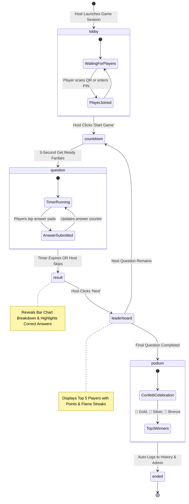

# ⚡ QuizRush

> A high-energy, real-time multiplayer quiz platform inspired by Kahoot, engineered for seamless hosting on **Vercel** with Google OAuth, QR code & 4-character PIN joining, Admin History & Analytics, Email dispatch, and **$4.99 Pay-Per-Quiz Monetization (after 1 free trial)**.


---

## 🗺️ System Architecture & Workflow Diagrams

### 1. Host vs. Player End-to-End User Journey



---

### 2. Monetization & Paywall Lifecycle Diagram

```mermaid
flowchart TD
    Start[Host clicks 'Host Live'] --> CheckQuota{Free Trials Remaining > 0?}
    CheckQuota -- Yes (1st Quiz) --> DeductTrial[Deduct 1 Free Trial Pass]
    DeductTrial --> Launch[Generate PIN & Launch Game Arena]
    
    CheckQuota -- No (2nd Quiz+) --> CheckCredits{Paid Credits > 0?}
    CheckCredits -- Yes --> DeductCredit[Deduct 1 Paid Quiz Credit]
    DeductCredit --> Launch

    CheckCredits -- No --> ShowPaywall[Display $4.99 Paywall Modal]
    ShowPaywall --> Checkout[Stripe Checkout Session: $4.99]
    Checkout --> Success[/host/checkout/success]
    Success --> CreditAccount[Credit Account +1 Match Pass]
    CreditAccount --> Launch
```

---

### 3. Live Interactive Game State Machine



---

## 💰 Monetization: $4.99 / Quiz (After 1 Free Trial)

QuizRush implements a transparent, high-converting pay-per-quiz model:

| Model Tier | Cost | Included Quota | Features |
| :--- | :--- | :--- | :--- |
| **Starter Trial** | **$0** (Free) | **1 Complete Match** | Up to 100 players, live audio, QR lobby, single & multi-choice, confetti podium |
| **Single Match Pass** | **$4.99** / quiz | **1 Live Match** | Full multiplayer session pass, unlimited custom quizzes, session analytics, email scorecards |

- **No monthly recurring subscriptions**: Hosts only pay when they actually organize a quiz match.
- **Stripe Checkout Ready**: Seamless card, Apple Pay, and Google Pay support via Stripe.
- **Zero-Friction Dev Mode**: Includes an instant test unlock button so you can test credit deduction and session unlocking locally without Stripe credentials.

---

## 🌟 Key Features

### 👑 For Quiz Organizers & Hosts
- **Google / Gmail Authentication**: 1-click Google OAuth (with seamless fallback mode).
- **Flexible Question Authoring Studio**:
  - **Single Choice (1 of 4)**: Classic Kahoot format (Red Triangle ▲, Blue Diamond ◆, Yellow Circle ●, Green Square ■).
  - **Multiple Choice**: Support for questions requiring players to select multiple valid answers with checkboxes and a submit confirmation button.
  - Configurable countdown timers (10s, 20s, 30s, 60s, 90s).
  - Configurable scoring with speed bonuses.
  - Cover images and custom question prompts.
- **Big Screen Arena (`/host/lobby/[pin]`)**:
  - Dynamic **4-character Game PIN** (e.g. `K9R2`).
  - Scannable **Live QR Code** on screen for instant zero-friction player joins.
  - Real-time connected player list with animated avatar entries.
  - Post-question **Bar Chart Results** breakdown with highlighted correct answers.
  - Top 5 animated **Scoreboard & Streak Tracking** (🔥 *3 in a row!*).
  - Triumphant **1st, 2nd, and 3rd Place Podium** with fireworks confetti celebration (`canvas-confetti`)!

### 🛡️ Admin Dashboard, History & Email Center (`/admin`)
- **Complete Session History**: View all previously hosted games, timestamps, PINs, participant counts, winners, and accuracy metrics.
- **Revenue & Pass Sales Tracking**: Real-time display of total passes sold and estimated gross revenue ($4.99/ea).
- **Per-Question Accuracy Drilldowns**: Inspect how players performed on each individual question with animated color progress bars.
- **CSV Data Export**: 1-click download of session scorecards, rankings, and player data as `.csv` files.
- **Email Service (`/api/send-email`)**:
  - **Quiz Invitations**: Send invitation emails containing game PIN, direct join link, and QR code instructions.
  - **Session Scorecards**: Dispatch formatted HTML leaderboard reports to players or organizers after a match.
  - **Zero-Failure Mode**: Works out of the box with simulated live HTML preview, and seamlessly hooks into `RESEND_API_KEY` for production email delivery.

### 📱 For Quiz Takers / Players
- **Zero Login Friction**: Players do **not** need an account or password.
- **Scan & Play**: Join directly by pointing your phone camera at the host's QR code or entering the 4-char PIN at `/join`.
- **Avatar & Nickname Picker**: Pick a custom robot or avatar.
- **Interactive Game Pad (`/play/[pin]`)**:
  - Giant tactile shape buttons (Red Triangle, Blue Diamond, Yellow Circle, Green Square).
  - Immediate visual & haptic submission confirmation.
  - Instant score breakdown and rank reveals.
- **Built-in Audio Synthesizer**: Web Audio API generated lobby music, urgent countdown ticks, and triumphant sound chimes with zero external audio assets!

---

## 📚 10 Ready-to-Play Sample Quizzes Included

| # | Quiz Title | Topic Highlights | Question Types |
| :---: | :--- | :--- | :---: |
| 1 | **🏛️ World Capitals Showdown** | Australia, Canada, South Africa's 3 official capitals, Turkey, South America. | Single & Multi-Choice |
| 2 | **🚩 Flags of the World** | Nepal's non-rectangular flag, flags with plants, star counts, tri-color banners. | Single & Multi-Choice |
| 3 | **💰 Global Currencies & Money** | Japanese Yen, Eurozone member countries, South African Rand, Swiss Franc. | Single & Multi-Choice |
| 4 | **🗣️ World Languages & Polyglots** | Most native speakers, Switzerland's 4 national languages, Romance languages. | Single & Multi-Choice |
| 5 | **🗽 Wonders of the World & Landmarks** | Machu Picchu, New 7 Wonders, Burj Khalifa, iconic French monuments, Petra. | Single & Multi-Choice |
| 6 | **🍜 Global Cuisine & Foodie Trek** | Origins of the croissant, traditional basil pesto ingredients, Korean Kimchi. | Single & Multi-Choice |
| 7 | **🚀 Space & Astronomy Odyssey** | Hottest planets, rocky terrestrial planets, Saturn's rings, Galilean moons. | Single & Multi-Choice |
| 8 | **🔬 Science & Greatest Inventions** | Einstein's Relativity, noble gases, Mohs hardness scale, Nobel laureates. | Single & Multi-Choice |
| 9 | **🦁 Wild Kingdom & Animal Marvels** | Fastest land mammals (Cheetah), marsupials, Blue Whales, flightless birds. | Single & Multi-Choice |
| 10 | **⚡ Ultimate Tech & Coding Challenge** | JavaScript history, frontend frameworks (React, Vue, Svelte), CSS, HTTPS port 443. | Single & Multi-Choice |

---

## 🚀 Live Vercel Deployment Guide

QuizRush is designed to deploy to **Vercel** with zero hassle.

### Step 1: Push to GitHub & Import to Vercel
1. Push this repository to your GitHub account (`https://github.com/karuthevar/QuizRush.git`).
2. Go to [Vercel Dashboard](https://vercel.com/dashboard) and click **"Add New Project"**.
3. Import the `QuizRush` repository. Next.js will be detected automatically.

### Step 2: (Optional) Connect Production Keys
In your Vercel Project Settings under **Environment Variables**, add:
```env
# Firebase (Google OAuth & Real-Time Sync) - Spark Plan 100% Free
NEXT_PUBLIC_FIREBASE_API_KEY=your_api_key
NEXT_PUBLIC_FIREBASE_AUTH_DOMAIN=your_project.firebaseapp.com
NEXT_PUBLIC_FIREBASE_PROJECT_ID=your_project_id
NEXT_PUBLIC_FIREBASE_STORAGE_BUCKET=your_project.appspot.com
NEXT_PUBLIC_FIREBASE_MESSAGING_SENDER_ID=your_sender_id
NEXT_PUBLIC_FIREBASE_APP_ID=your_app_id
NEXT_PUBLIC_APP_URL=https://quizrush-mu.vercel.app

# Stripe Monetization ($4.99 per quiz after 1 free trial)
STRIPE_SECRET_KEY=sk_live_...
NEXT_PUBLIC_STRIPE_PUBLISHABLE_KEY=pk_live_...

# Resend Email Dispatch (Post-game scorecards & invites)
RESEND_API_KEY=re_xxxxxxxxxxxxxx
```
4. Click **Deploy**!

---

## 💻 Local Development

```bash
# Clone the repository
git clone https://github.com/karuthevar/QuizRush.git
cd QuizRush

# Install dependencies
npm install

# Start development server
npm run dev
```

Open [http://localhost:3000](http://localhost:3000) in your browser.

> **💡 Multi-Tab Test Tip**: Open the host screen on one browser window (`/host/dashboard`), and open an Incognito tab to `/join` with the generated 4-char PIN. Watch them sync in real time!

---

## 📄 License
MIT License. Created for the QuizRush community!
